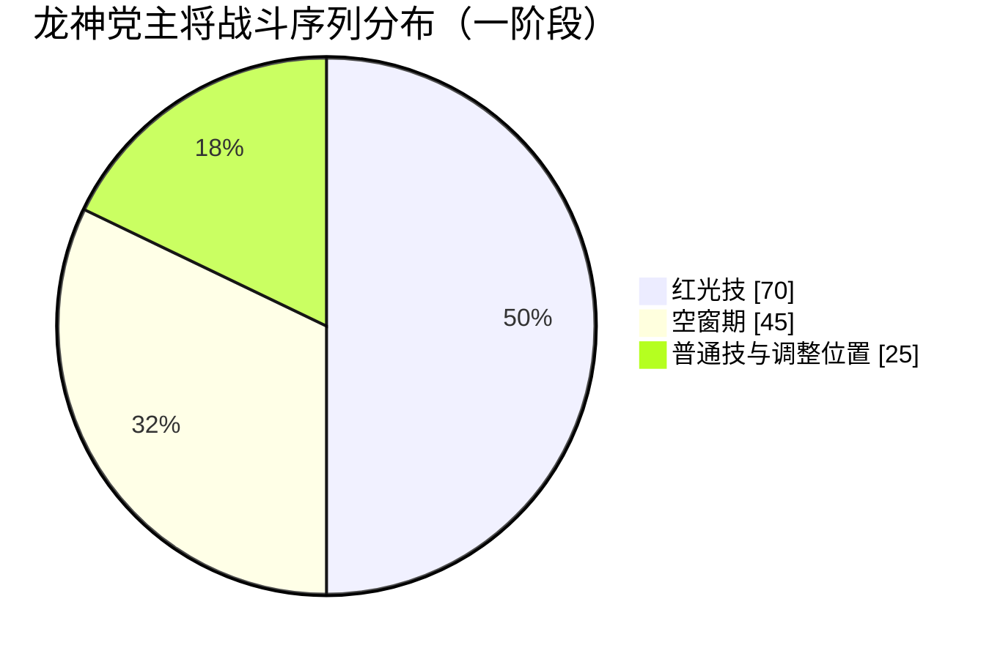
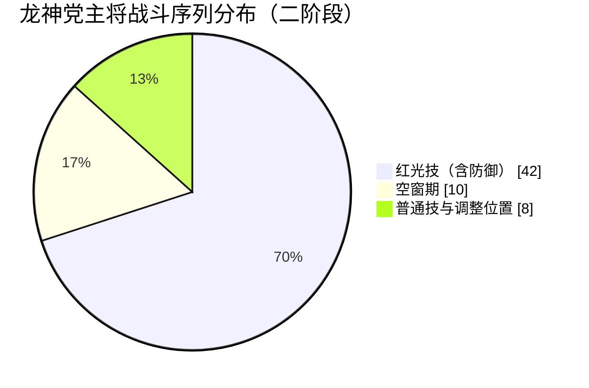

### 引言
忍者龙剑传4今年依旧无缘TGA最佳动作。想来也是当然的，忍龙作为一个横跨将近50年的老ip加上近期世界忍者文化潮流的褪去，热度上就无法企及别的新游戏了，再加上这套玩法已被拆散揉碎融入到各大游戏当中去，今年忍龙4的发售连个水花似乎都没激起来。
不过就游戏本身来讲，白金代工的4质量算上乘，完成度不错，顺带还解决了系列上的痛点：BOSS战，今天咱们就主要通过分析龙神党主将战斗AI行为来看看，白金是如何破除系列痛点的？

### 二、“龙神党主将”BOSS战斗AI行为拆解
#### 1.概述
新手BOSS是对玩家最基本的游戏操作的考验。而忍龙系列最核心的就是“高速的攻防转换“，4代加入了精防精闪相杀近几年动作游戏的标配机制，通过精闪的镜头强调与减速明确战斗节奏，精防提高防御收益，相杀降低出手责任，强化了高速攻防的循环玩法，让玩家由防转攻的机会增多，转换的频率变高，辅以现代3C等技巧让玩家”读懂“攻防，改善了系列Boss战的体验。我们本次主要从动画辅以行为树的角度进行boss战的体验拆解
#### 2.体验反推
本游戏主打”高速动作“，而本BOSS作为”教学官“，既要担起教学的责任，又要向玩家传达高速凌厉的体验，那么白金是如何做到的呢？我做了以下分析：

##### 2.1逆向动画文件
通过逆向工具进行动画资源的获取，用于核实对照后续要分析的战斗行为，顺带学习以下文件结构命名和动画拆分制作标准。
[忍龙4龙神党主将、加贺智动画对照表](https://docs.qq.com/sheet/DYkZzc0FHbUZnV0JS?tab=BB08J2)
上表整理出了龙神党主将所有的动画文件，总共有62个动画文件，红光技涉及8个文件，普通技7个文件，组合技4个文件，防御技7个文件，剩余的是演出相关的43个文件。
可以直观的看到，一阶段使用了3个红光技动画文件，而二阶段使用了6个，关于boss攻击烈度的
变化可见一斑。
##### 2.2战斗序列分析

【【忍者龙剑传4】龙神党主将ai行为分析】https://www.bilibili.com/video/BV1Cy6vB6Ehy?vd_source=65eff08aa6cdba2f25bb8fc655ac86b0
###### 2.2.1一阶段
通过录制一部分游戏战斗序列（boss一阶段）进行简单的AI行为分析，我们可以看出几点：

- 整体行为模式是”攻击——空窗——调整位置（如需）——攻击“循环
- 招式有复读的情况

结论：推测大部分招式用概率控制行为选择而非CD或其他手段，先通过距离远近锁定可选行为范围，再由概率决定行为。
目的：使用快速位移动画调整位置无缝衔接攻击营造”高速灵活“的战斗体验

- 有部分红光技是必定派生于部分普通技的（长连段后必出红光）
- 部分普通技非概率控制，只受玩家位置影响

结论：有部分行为在特殊情况下100%概率触发，是固定行为
目的：给予玩家一部分可掌控的部分，降低失控感，方便玩家掌握行动规律逻辑

我们再进一步进行统计：
在2分20秒的一阶段战斗序列中，空窗期单次持续时间约为1.5秒，累计出现空窗期30次，共计45秒。红光技单次持续时间约为3.5秒，累计出现红光技20次，共计70秒。剩余的时间为普通技以及极短的调整位置的时间，普通技累计出现21次，调整位置累计出现8次，共计25秒。

| 类型名称 | 出现频次 | 单次持续时间 | 累计时间 |
| ---- | ---- | ------ | ---- |
| 空窗期  | 30次  | 约1.5秒  | 45秒  |
| 红光技  | 20次  | 约3.5秒  | 70秒  |
| 普通技  | 21次  | 约1.7秒  | 25秒  |
于是有以下饼图：

通过上述图我们可以得知三条比较关键的结论：
- 空窗期与攻击的时间比例大概是3:7，这就是”高速“体验的基本数据
- 普通与红光的时间比例大概是2:5，这就是作为新手boss”教学“责任的基本数据。红光是风险也是机会，是考验玩家运用新机制的关键时刻，也是玩家进行输出的主要窗口，动画需要做的足够长，足够明显，在易读的情况下还要足够具有张力与威胁性。给予玩家充分的时间学习新机制打断红光就是”教学官“的职责
- 红光与普通的出现频次相当，是因为出现了多次必定派生的情况，同样也是”教学“的责任所在，便于玩家熟悉boss的行动逻辑  

###### 2.2.2二阶段
同样二阶段，有了前面的思路这次可以录短一点，1分钟的战斗序列，通过观察，空窗期单次持续时间约0.8秒，总共出现了12次，累计约10秒；红光技单次持续时间约3.4秒，总共出现11次，累计约36秒，普通技总共出现4次，与3次调整围着合算累计约8秒；防御技单次持续时间约2秒，总共出现3次，累计6秒。因防御技最终派生红光，并且都会被新机制”血刀“打断，图表内数据将于红光合算。

| 类型名称      | 出现频次 | 单次持续时间        | 累计时间 |
| --------- | ---- | ------------- | ---- |
| 空窗期       | 12次  | 约0.8秒         | 约10秒 |
| 红光技（含防御技） | 14次  | 约3.4秒（防御技2秒）  | 约42秒 |
| 普通技       | 7次   | 约2秒（调整位置0.5秒） | 约8秒  |
   于是有以下饼图：

由上图可以看出：
- 二阶段空窗期与攻击的比例来到了1:5左右，单次持续时间约为0.8秒，二阶段玩家基本上没有回旋思考的时间，留给玩家的只有boss一次次出给玩家的题目，动作衔接更加迅速凌厉，”高速“的体验更上一层楼。
- 红光时间占据70%，这70%的时间内玩家将受到巨额伤害的威胁，但boss也随时处于可被打断的状态之中，这已经明牌展示了，只要学会运用新机制”血刀“打断红光技（防御技），就能通过这个boss。
- 二阶段红光技的出现频次远超普通技，同上，是对玩家技巧掌握的最终考验。（顺带一提，通过之前的动画表来看，二阶段动画资源的投入量也是一阶段的两倍左右，主唱Victor Borba（没错就是鬼泣5同款主唱） 也是在二阶段才开嗓，可以说二阶段才是高速体验的高潮）

#### 3.行为树
上述毕竟只是一部分战斗序列，有一定局限性，比如表中的防御技需要玩家进行攻击ai才会进行响应，上述视频中并无体现。我们接着深入进行多次尝试观察后，结合上述的拆包和分析，简单的整理出如下的行为树图：

###### 3.1一阶段：
![[忍者龙剑传4龙神党主将战斗AI行为树（一阶段）.png]]
上图应该比纯观察战斗序列更详细，是比较接近实际ai行动的图了。其实boss在受击时还会做出更多互动的动作，如上图所示
###### 3.2二阶段：
![[忍者龙剑传4龙神党主将战斗AI行为树（二阶段）.png]]
在一阶段基础之上更换了一套脱手大范围技能组，使其给人的感觉更加凌厉，整体思路不变。
在二阶段中有以下更丰富的层次变化：
- 有一6hit红光技仅在二阶段血量低于50%时才会出现
- 有一后撤红光技仅在难度为”极难“模式下出现
二阶段的行为树相较一阶段砍去了受击看破与弹刀与特定身位的出招，增加了会派生红光的格挡技，其设计目的都是为了让boss二阶段更具攻击性以逼迫玩家使用新机制打断红光。

###### 3.3尝试简单抽象
整理出行为树图后，我们可以尝试简单地进行一下抽象总结：
![[忍者龙剑传bossAI设计抽象行为树图.png]]
虽然一二阶段有差别，但基本都遵循这个范式行动，做阶段差别只需要在这个框架下，调整空窗期时间、保证固定连段由红光技收尾的情况下自由增添更换技能组即可。

在整个行为树中boss的行为与自身血量、玩家的方位、距离玩家的距离、游戏选择的难度挂过狗，那么再继续扩展思考，如果用这个框架做自己的boss时，是否能让条件要素更丰富一点以达成更多变灵活的boss？我想了几点：
- 与关卡场景的交互物互动挂钩
- 与玩家当前资源挂钩
- 与玩家近期输入挂钩（不是即时的读指令，而是存储近几十秒的输入指令分析然后选择不同的行为）
就当作瞎想想，真落地还得再细细琢磨
### 结语
本次从龙神党主将战斗ai行为分析的角度去说明了白金解决系列痛点的手段，总结起来有几个点：
- 引入了精防/精闪/相杀/offset/强化攻击/信号灯等现代动作游戏常用的机制，重构起新的玩法循环
- 新手boss选用人型敌人，降低玩家理解门槛
- 3C视觉强调，让玩家读懂攻防
- 新手bossAI行为围绕核心机制设计，分阶段大量出现红光技，专门负责红光处理的教学
（不光是主将，整个个流程安排上相比前代去掉了很多演出型的boss，专注于机制教学）

  以上就是本次忍龙4龙神党主将战斗AI行为分析的全部了，本次只使用了传统的方法进行了推敲分析，希望后面能有机会用实际反编译的脚本来进行进一步的分析。文章如有纰漏请多多指出，不足之处还请多多包含。

### 参考资料&感谢：
[《只狼战斗的核心：一场刀光剑影的乒乓球》 - 知乎](https://zhuanlan.zhihu.com/p/65128052
[拆包看狮子猿AI设计 | 设计者笔记](https://design.jskyzero.com/2023/10/10/sekiro_lion_tamarin_AI/)
[Home | DTZxPorter](https://dtzxporter.com/)
[忍龙4 - 白金动作逆向学习](https://www.bilibili.com/video/BV1tZ1cBaEFC?vd_source=65eff08aa6cdba2f25bb8fc655ac86b0)